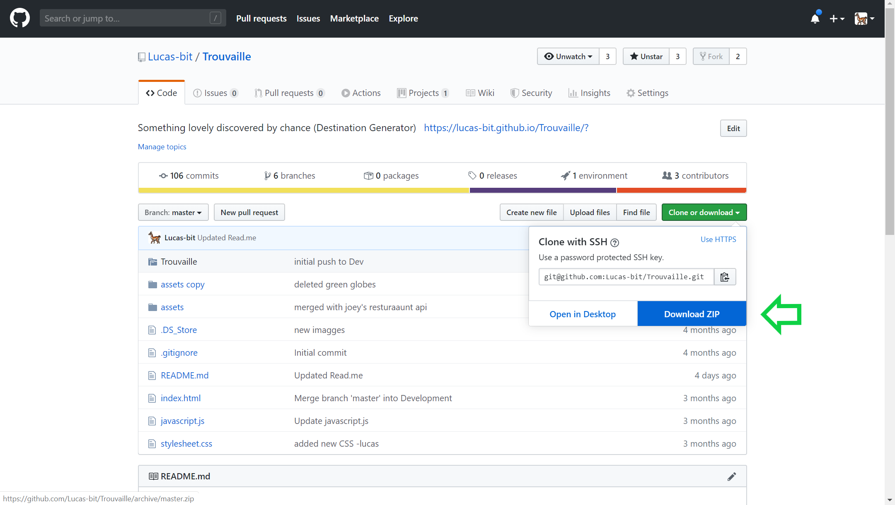

# Trouvaille
Something lovely discovered by chance.

A destination generator app for the traveler who knows they want to travel, but can't make up their mind on where to go. 
With this application one is able to narrow their options down by selecting a region, which then gives the user a list of countries within that region and finally after selecting the country a list of popular cities. 

The user is then presented with up to 5 restuarants and 5 points of interest located within the selected city as well as a map of the city.

# Getting Started
These instructions will get you a copy of the project up and running on your local machine for development and testing purposes: Download a copy of the zip file from Github as pictured below. 

Unzip the zip file and then open the file in your code editor of choice.

# Built With
VS Code

Javascript, JQuery, Ajax, HTML5, CSS3

# Authors/Contributers 

Joseph Register https://github.com/jreg1258
Khalid Muhammad https://github.com/KhalidM53

